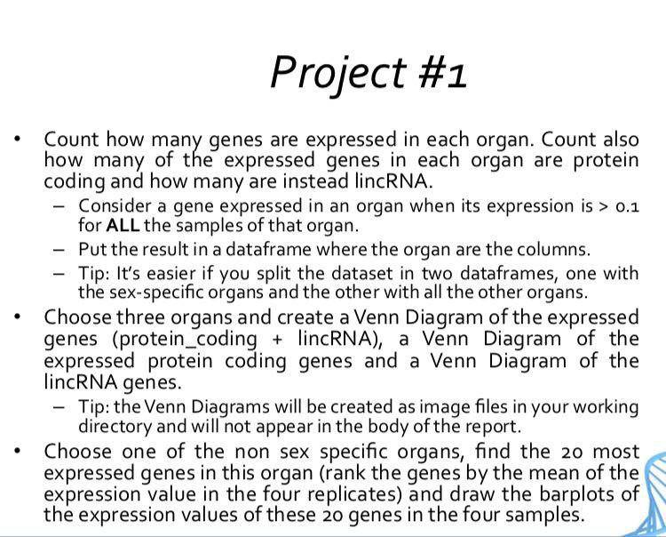
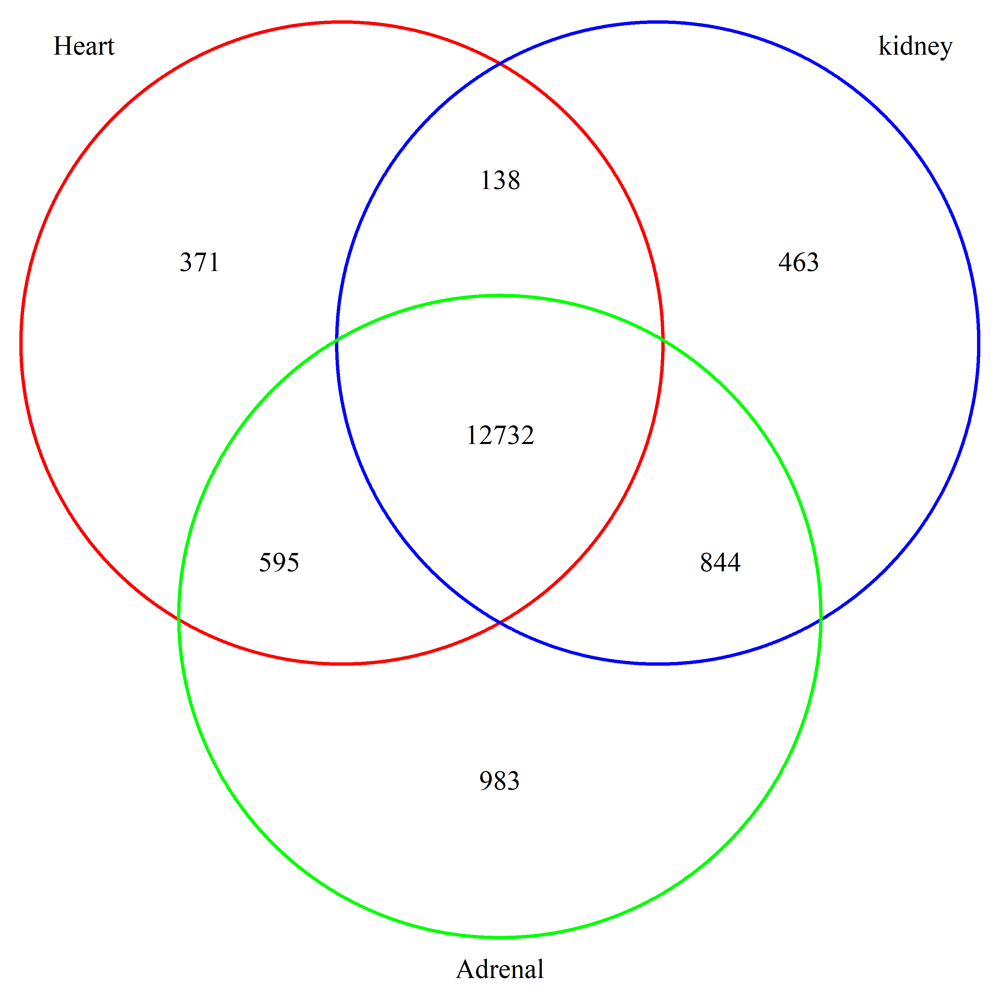
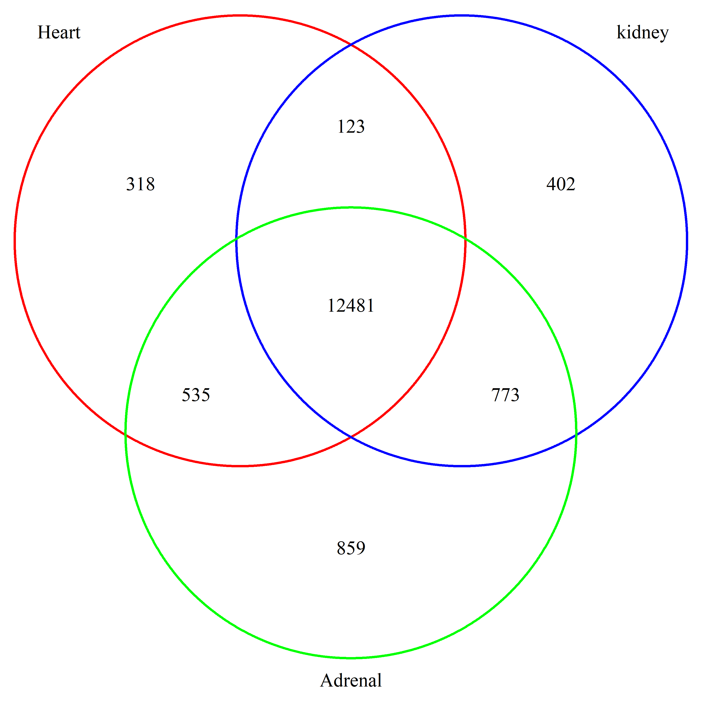
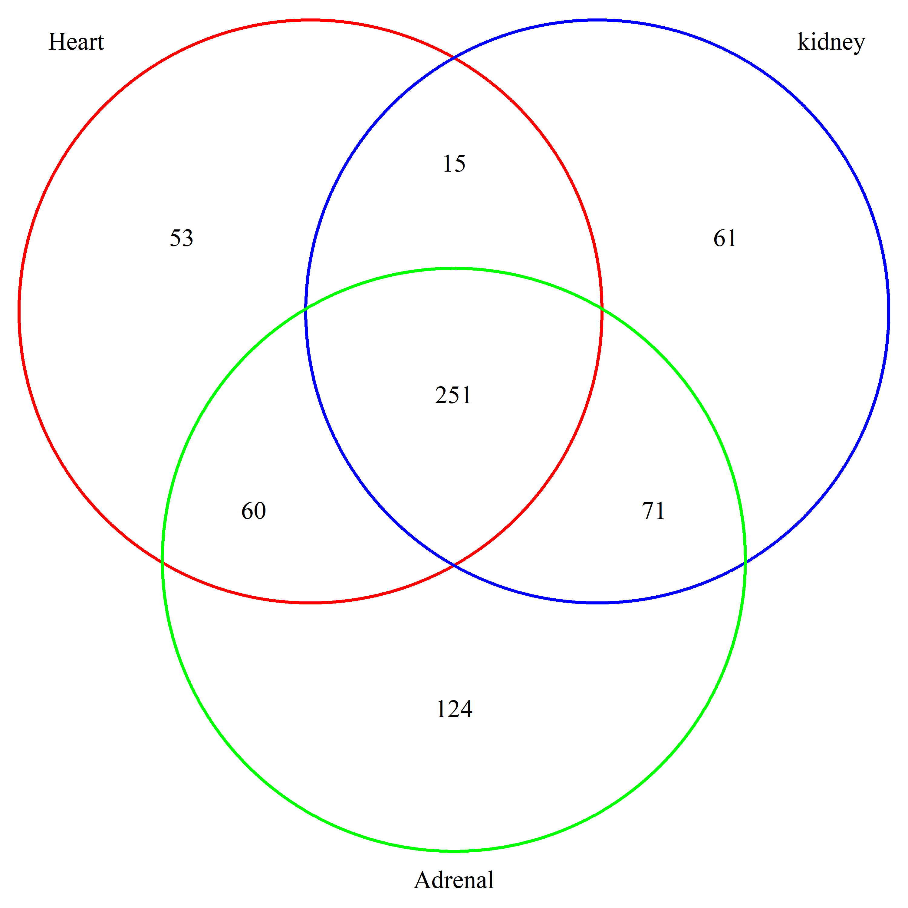

# mouseg_gene_data_analysis

### The project



```{r}
    library(VennDiagram)
    library(stringr)
    library(ggplot2)
```

### Load the data into R

```{r}
dataSet <- read.table("./data.txt", sep="\t")
# head(dataSet)
```


##### Let’s replace the thymys column names by thymus
```{r}
  names(dataSet) <- str_replace(names(dataSet), pattern = 'Thymys',replacement = 'Thymus')
```
  
##### Let’s find all the organs
To get the right names for the organs we use the `strsplit()` function passing it a `_` to split the names of the columns. It return a list containing for all the column names the different part after the spiting and we use the `sapply()` function on that list and we pass function that will grabe for each column the first element correspoding to the name of the organ.

```{r}
organs <- unique((sapply(strsplit(names(dataSet), "_"), function(x)x[[1]])))
organs
```

##### Let’s split the dataset into sex specific and non sex specific
To split the data into sex and non-sex specific data set we perform this steps:

- We compute a vector for columns where sex specific columns are TRUE by using the `str_starts()` function passing it the names of the columns in the dataset except the `gene_type` column and and a pattern of string matching the names of sex specific organs

```{r}
sex_specific_organ <- str_starts(names(dataSet[-1]), pattern = "Vescicular|Uterus|Ovary|Testis")
sex_specific_organ
```


- We subset the data using the vector we get above and get all the column that are sex specific and added `TRUE` in  `c(TRUE, sex_specific_organ)` to get the gene_type column
```{r}
sex_specific_data <- dataSet[,c(TRUE, sex_specific_organ)]
head(sex_specific_data)
```

We subset the data using the the negation of vector`!sex_specific_organ` we get above and get all the column that are sex specific and added `TRUE` in `c(TRUE, sex_specific_organ)` to get the gene_type column
```{r}
non_sex_specific_data <- dataSet[,c(TRUE, !sex_specific_organ)]
```

### Get the count of expressed genes for each organs
To get the gene expression of each organ we first write the `get_gene_cout()` function. The function take an organ name and a dataset to return a simple data frame containing in one column the `gene_type` and in another the count of the genes expressed. The second column have the name of the organ passed to the function as column name

- select sample of an organ and the `gene_type` column
- for each row we take every sample check if the value is greate than 0.1 and make the sum of boolean values for each row
- check if the gene is expressed by taking the row sum and see if it is equal to the number of samples for the organ
- use the codition to filter all samples and get only expressed genes
- we use the table function to count the number of `lincRNA` and `coding_protein` in expressed genes
- we get the gene type count as a data frame
- we give the data frame the appropriate names

```{r}
get_gene_count <- function(organ,data){
  all_samples <- data[,str_starts(names(data), pattern = paste("gene", organ, sep = "|"))] 
  gene_expressed_row_sum <- rowSums(all_samples[,-1]>0.1)
  gene_expressed_check <- gene_expressed_row_sum == dim(all_samples[,-1])[2] 
  gene_expressed <- all_samples[gene_expressed_check,] 
  gene_expressed <- table(gene_expressed$gene_type)
  gene_count <- as.data.frame(gene_expressed)
  names(gene_count) <- c("gene_type",organ)
  gene_count 
}
```


##### Get the count of expressed genes for each sex non specific organ passing to `get_gene_count()` function the gene name and the `non_sex_specific_data` data set

```{r}
Adrenal <- get_gene_count("Adrenal",non_sex_specific_data)
Brain <- get_gene_count("Brain", non_sex_specific_data)
Forestomach <- get_gene_count("Forestomach",non_sex_specific_data)
Heart <- get_gene_count("Heart",non_sex_specific_data)
Kidney <- get_gene_count("Kidney",non_sex_specific_data)
Liver <- get_gene_count("Liver",non_sex_specific_data)
Large <- get_gene_count("Large",non_sex_specific_data)
Lung <- get_gene_count("Lung",non_sex_specific_data)
Muscle <- get_gene_count("Muscle",non_sex_specific_data)
Small <- get_gene_count("Small",non_sex_specific_data)
Spleen <- get_gene_count("Spleen",non_sex_specific_data)
Stomach <- get_gene_count("Stomach",non_sex_specific_data)
Thymus <- get_gene_count("Thymus",non_sex_specific_data)
```

##### bind all the column of non sex specific organs but select `gene_type` column only for the first organ to avoid duplication of the `gene_type` column

```{r}
sex_exp_gene_count <- cbind(Adrenal,Brain[2],Forestomach[2],Heart[2],Kidney[2],Liver[2],Large[2],Lung[2],
                        Muscle[2],Small[2],Spleen[2],Stomach[2])
sex_exp_gene_count
```


##### Get the count of expressed genes for each sex non specific organ passing to `get_gene_count()` function the gene name and the `sex_specific_data` data set
```{r}
Vescicular <- get_gene_count("Vescicular",sex_specific_data)
Uterus <- get_gene_count("Uterus",sex_specific_data)
Ovary <- get_gene_count("Ovary",sex_specific_data)
Testis <- get_gene_count("Testis",sex_specific_data)
```


##### Bind all the column sex specific organs but select `gene_type` column only for the first organ to avoid duplication of the `gene_type` column
```{r}
non_sex_exp_gene_count <- cbind(Ovary,Thymus[2],Uterus[2],Vescicular[2])
non_sex_exp_gene_count
```

###  Venn Diagramm for the three organs : *kidney*, *heart* and  *Adrenal_gland*

- select sample of an organ and the gene_type column
- for each row we take every sample check if the value is greate than `0.1` and make the sum of boolean values for each row
- check if the gene is expressed by taking the row sum and see if it is equal to the number of samples for the organ
- use the codition to filter all samples and get only expressed genes
- we store the names of the genes in a new column named `gene_names`
- We select the `gene_type` and the `gene_name` column

```{r}
get_expressed_genes <- function(organ){
  all_samples <- dataSet[,str_starts(names(dataSet), pattern = paste("gene", organ, sep = "|"))]
  gene_expressed_row_sum <- rowSums(all_samples[,-1]>0.1)
  gene_expressed_check <- gene_expressed_row_sum == dim(all_samples[,-1])[2] 
  gene_expressed <- all_samples[gene_expressed_check,] 
  gene_expressed$gene_name <- rownames(gene_expressed) 
  gene_expressed <- gene_expressed[c("gene_type", "gene_name")]  
  gene_expressed 
}
```


##### get genes expressed in kidney
```{r}
kidney_genes <- get_expressed_genes("Kidney") 
head(kidney_genes)
```
##### get genes expressed in Heart
```{r}
heart_genes <- get_expressed_genes("Heart") 
head(heart_genes)
```
##### get genes expressed in Adrenal
```{r}
adrenal_genes <- get_expressed_genes("Adrenal") 
head(adrenal_genes)
```

### Ploting the venn diagrams
- store the organ names in `venn_titles` variable 
```{r}
venn_titles <- c("Heart", "kidney", "Adrenal")
```
#### Venn diagram for *heart*, *kidney* and *adrenal* for all expressed genes
```{r,results='hide'}
venn.diagram(x = list(heart_genes$gene_name, kidney_genes$gene_name, adrenal_genes$gene_name), 
             category.names = venn_titles,
             imagetype = "png",
             filename = 'Venn_diagram_1.png', 
             col = c("red", "blue", "green"))
```

{ width=50% }

#### Venn diagram for *heart*, *kidney* and *adrenal* for all expressed genes of type `coding_protein`
```{r, results='hide'}
venn.diagram(x = list(heart_genes[heart_genes$gene_type=="protein_coding","gene_name"], 
                      kidney_genes[kidney_genes$gene_type=="protein_coding","gene_name"], 
                      adrenal_genes[adrenal_genes$gene_type=="protein_coding","gene_name"]), 
             category.names = venn_titles,
             imagetype = "png",
             filename = 'Venn_diagram_2.png', 
             col = c("red", "blue", "green"))
```


{ width=50% }

#### Venn diagram for *heart*, *kidney* and *adrenal* for all expressed genes of type `lincRNA`
```{r, results='hide'}
venn.diagram(x = list(heart_genes[heart_genes$gene_type=="lincRNA","gene_name"], 
                      kidney_genes[kidney_genes$gene_type=="lincRNA","gene_name"], 
                      adrenal_genes[adrenal_genes$gene_type=="lincRNA","gene_name"]), 
             category.names = venn_titles,
             imagetype = "png",
             filename = 'Venn_diagram_3.png', 
             col = c("red", "blue", "green"))
```

{ width=50% }


### We choose the `Liver` and make the barplot for 20 most expressed genes

- select sample of the liver organ and the `gene_type` column
```{r}
  liver_samples <- dataSet[,str_starts(names(dataSet), pattern ="Liver")] 
```
- for each row we take every sample check if the value is greate than `0.1` and make the sum of boolean values for each row
```{r}
  gene_expressed_row_sum <- rowSums(liver_samples>0.1) 
```
- check if the gene is expressed by taking the row sum and see if it is equal to the number of samples for the organ
```{r}
  gene_expressed_check <- gene_expressed_row_sum == dim(liver_samples)[2] 
```
- we filter the data and select expressed genes 
```{r}
  liver_genes <- liver_samples[gene_expressed_check,]
```
- we conpute the row mean using the for samples
```{r}
  liver_genes$row_mean <- rowMeans(liver_genes)  
```
- we order the expressed data according to the row_mean
```{r}
  liver_genes_ordered <- liver_genes[order(liver_genes$row_mean, decreasing = TRUE),]
```
- select the 20 most expressed genes 
```{r}
  liver_20_genes <- head(liver_genes_ordered, n=20) 
```

  
  
#### Drawing the barplot for each sample of data for the liver organ and also using the `rownames` as the label for the `x axis`

#### Ploting liver female 1 20 most expressed genes

```{r}
ggplot(liver_20_genes, aes(rownames(liver_20_genes), Liver_Female_1)) +
    labs(title = "Liver female 1 20 most expressed genes", x="genes names", y="gene expression level") +
    geom_bar(stat = "identity",fill="pink") + theme(axis.text.x = element_text(angle = 90))
```

#### Ploting liver female 2 20 most expressed genes

```{r}
ggplot(liver_20_genes, aes(rownames(liver_20_genes), Liver_Female_2)) + 
    labs(title = "Liver female 2 20 most expressed genes", x="genes names", y="gene expression level") +
    geom_bar(stat = "identity", fill="red") + theme(axis.text.x = element_text(angle = 90))
```

#### Ploting liver male 2 20 most expressed genes

```{r}
ggplot(liver_20_genes, aes(rownames(liver_20_genes), Liver_Male_1)) + 
    labs(title = "Liver male 1 20 most expressed genes", x="genes names", y="gene expression level") +
    geom_bar(stat = "identity", fill="lightgreen") + theme(axis.text.x = element_text(angle = 90))
```

#### Ploting liver male 2 20 most expressed genes


```{r}
ggplot(liver_20_genes, aes(rownames(liver_20_genes), Liver_Male_2)) + 
    labs(title = "Liver male 2 20 most expressed genes", x="genes names", y="gene expression level") +
    geom_bar(stat = "identity", fill="darkorange") + theme(axis.text.x = element_text(angle = 90))
```
